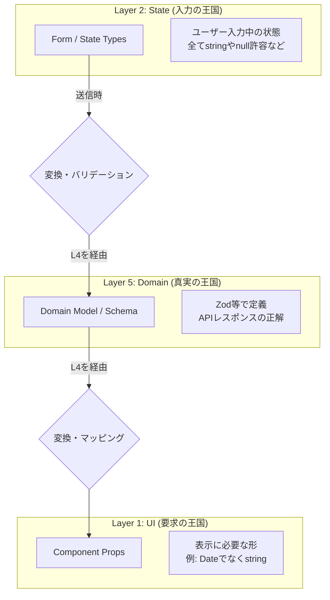

型定義の取り扱いは、アーキテクチャの堅牢さを決める**最重要ポイント**の一つです。

この5層アーキテクチャにおいて、型は**「3つの王国」**に分けて管理し、**Layer 3（またはLayer 4のセレクタ）**で変換（マッピング）するのが正解です。

以下に「定義場所」「活用場所」「変換場所」の黄金ルールをまとめます。

---

### 型の「3つの王国」とデータの流れ



---

### 1. 定義する場所（Where to Define）

型を定義すべき場所は、主に以下の3箇所です。

#### A. Layer 5: Domain Core（ドメインモデル）

**「システムとしての正解」**を定義します。Zod推奨。

* **ファイル:** `features/meal/model/schema.ts`
* **内容:** DBやAPIの構造に即した型。
* **例:** `Meal` 型（`createdAt: Date` や `price: number` を持つ）。

#### B. Layer 1: UI Presentation（UI Props）

**「画面表示の要求仕様」**を定義します。

* **ファイル:** `features/meal/components/MealCard.tsx` (または同階層の `types.ts`)
* **内容:** 画面表示に必要なデータのみ。ドメインモデルを知らなくて良い。
* **例:** `MealCardProps` 型（`displayDate: string` や `priceLabel: string` を持つ）。

#### C. Layer 2: Headless Hooks（入力状態）

**「編集中の緩いデータ」**を定義します。

* **ファイル:** `features/meal/hooks/useMealForm.ts`
* **内容:** バリデーション前の、ユーザーが入力した生の型。
* **例:** `MealFormValues` 型（数値入力でも一時的に `string` だったり、必須項目が `null` だったりする）。

---

### 2. 変換する場所（Where to Transform）

ここが最重要です。**Layer 3 (Page) を「アダプター（変換器）」として使います。**

#### パターン①：表示時（Read）

**Layer 5 (Domain) → Layer 1 (UI)**

ドメインの「リッチなデータ」を、UI用の「表示しやすいデータ」に変換します。

* **変換場所:** **Layer 3 (Page/Container)**
* ※ロジックが複雑な場合は、Layer 4に `selectors` を作ってもOKですが、基本はLayer 3で配線する時に変換します。


* **AIへの指示:**
> 「L4から取得した `Meal` データを、L1の `MealCard` コンポーネントが必要とするPropsに変換（マッピング）して渡して。日付は `YYYY/MM/DD` 形式の文字列にして。」


```typescript
// Layer 3: TodayPageContent.tsx

// L4からドメインデータを取得
const { meals } = useMealData(); 

return (
  <>
    {meals.map(meal => (
      // ★ここで変換！ (Domain Type -> UI Props)
      <MealCard
        key={meal.id}
        title={meal.name}
        // Date型をUI用の文字列に変換
        dateLabel={format(meal.ateAt, 'MM/DD HH:mm')} 
        // 数値をカンマ区切り文字列に変換
        caloriesLabel={`${meal.calories.toLocaleString()} kcal`}
      />
    ))}
  </>
);

```

#### パターン②：保存時（Write）

**Layer 2 (Form) → Layer 5 (Domain/API)**

フォームの「緩いデータ」を、API送信用の「厳密なデータ」に変換します。

* **変換場所:** **Layer 5 (Domain Service)** または **Layer 4 (Feature Hook)**
* **理由:** バリデーションロジックやデータ整形ロジックは「ビジネスロジック」に属するため、UI層（Layer 3）に書くべきではありません。

```typescript
// Layer 5: mealService.ts

// Zodを使って変換・検証ロジックをここに閉じ込める
export const createMealDtoSchema = z.object({
  // 文字列の"100"を数値の100に変換
  calories: z.string().transform((val) => parseInt(val, 10)),
  // ...
});

// Layer 4: useMealFeature.ts
const handleSubmit = (formValues: MealFormValues) => {
  // ★ここで変換！ (Form Type -> Domain Type)
  // L5のSchemaを使ってパースする（安全な変換）
  const payload = createMealDtoSchema.parse(formValues);
  mutation.mutate(payload);
};

```

---

### 3. AI駆動開発でのベストプラクティス

このルールをAI（Cursor等）に守らせるためのコツです。

1. **「L1はL5を知らない」ルール**
AIに「UIコンポーネント（L1）を作るとき、Domainモデル（L5）を直接importしないで。必要なプロパティはPropsで個別に定義して」と指示します。
* **メリット:** UIの再利用性が高まり、バックエンドの仕様変更時にUIファイルまで修正しなくて済みます。


2. **「マッパー関数」を作らせる**
Layer 3でインラインで変換するコードが増えてきたら、AIにこう指示します。
> 「`Meal` (Domain) を `MealCardProps` (UI) に変換する純粋なマッパー関数 `mapMealToCardProps` を作って。」
> これもテストしやすく、コードがスッキリします。


### まとめ

* **定義:**
* **L5:** 真実（API/DB型）
* **L1:** 要求（表示型）
* **L2:** 入力（フォーム型）


* **変換:**
* **表示（Read）:** **L3** で L5→L1 へ変換（整形）。
* **保存（Write）:** **L4/L5** で L2→L5 へ変換（バリデーション・パース）。


この「変換の責務」を明確にすることで、**「DBのカラム名が変わったら画面が真っ白になった」という事故を完全に防げます。**

ご提示いただいたコードは、先ほど議論した「5層レイヤードアーキテクチャ（Ver.2.0）」の**教科書的な実装例**になっています。

コードの断片がどのように各レイヤーにマッピングされ、どう連携しているか具体的に解説します。この解説を読みながらコードを見直すと、設計意図がよりクリアになるはずです。

---

### 全体像：データと依存の流れ

下層（データ）から上層（UI）へ、データがどう流れ、加工されていくかを見ていきます。

```mermaid
graph BT
    L5[Layer 5: Domain Core<br>targetContract / targetService] -->|APIデータ| L4
    L4[Layer 4: Feature Logic<br>useTodayNutritionProgress] -->|React Query状態| L3
    L3[Layer 3: Page Aggregation<br>useTodayPageModel] -->|ページ用データ束| L2
    L2[Layer 2: UI Orchestration<br>TodayPageContent (Container)] -->|Props| L1
    L1[Layer 1: Visual Components<br>DailySummaryCard]

```

---

### Layer 5: Domain Core（真実の王国）

**「Reactを知らない、純粋なTypeScriptの領域」**

ここにはビジネスルールと型定義があります。

* **`targetContract.ts` (Schema / Type)**
* **役割:** Zodを使って「データの正解」を定義しています。
* **ポイント:** `TargetSchema` が全ての源流です。APIレスポンスがこの形であることを保証しています。
* ```typescript
  export const TargetSchema = z.object({ ... }); // 唯一の真実
  export type Target = z.infer<typeof TargetSchema>;

```


* **`targetClient.ts` (Infrastructure)**
* **役割:** 実際に外部と通信する部分。
* **ポイント:** ここで `TargetSchema.parse(raw)` を行っているのが素晴らしいです。汚い外界のデータを、綺麗なドメインデータに変換してからシステム内に入れています。


* **`targetService.ts` (Domain Service)**
* **役割:** ビジネスロジックのクラス。
* **ポイント:** `Promise<Target | null>` を返す純粋なクラスメソッドです。React Hooksは一切使われていません。
* ```typescript
  export class TargetService {
    async getActiveTarget() { ... } // 純粋なロジック
    validateTargetForProgress(target) { ... } // ドメインルール
  }

```


---

### Layer 4: Feature Logic（Reactへの翻訳者）

**「ドメインデータをReactの状態（State）に変換する領域」**

* **`useTodayNutritionProgress.ts`**
* **役割:** `TargetService` (L5) を使い、React Queryでデータの取得・キャッシュ管理を行います。
* **ポイント:**
1. **サービスの注入:** `const targetService = useTargetService();` でL5を呼び出しています。
2. **状態管理:** `useQuery` を使い、`isLoading`, `isError`, `data` を管理しています。
3. **データ加工:** `nutritionProgressService.calculateProgressData` を呼んで、APIの生データ (`Target`) を、UIが表示しやすい形 (`NutrientProgress[]`) に加工しています。これが**UIへの「翻訳」**です。


---

### Layer 3: Page Aggregation（ページの司令塔）

**「バラバラの機能を1つのページとしてまとめ上げる領域」**

* **`useTodayPageModel.ts`**
* **役割:** 複数のFeature Hook (L4) を集約し、このページに必要な情報を一つのオブジェクト `m` にまとめます。
* **ポイント:**
* `nutrition` (栄養機能), `meals` (食事機能), `dailyReport` (レポート機能) をここでインスタンス化しています。
* UIコンポーネントは、このフックが返す巨大なオブジェクト `return { nutrition, meals, ... }` さえ受け取れば、ページの全てを描画できるように設計されています。


---

### Layer 2: UI Orchestration（配線と振る舞い）

**「見た目を持たない、UIの制御装置」**

ここでは `TodayPageContent.tsx` 自体が「Container Component」として Layer 2 の役割（配線）を担っています。また、専用フックも使われています。

* **`TodayPageContent.tsx` (の実装ロジック部分)**
* **役割:** L3からデータを受け取り、L1コンポーネントに配り、イベントをL4/L5のアクションに繋ぎます。
* **ポイント:**
* **配線:** `addMealModal.open(...)` のようなイベントハンドラを定義しています。
* **状態管理:** `const addMealModal = useAddMealModalState();` (コード内参照) がこれに当たります。モーダルの「開いているかどうか」という、**データとは関係ないUIの状態**を管理しています。


---

### Layer 1: Visual Components（純粋UI）

**「データを受け取って表示するだけの器」**

* **`DailySummaryCard.tsx`**
* **役割:** JSONデータを受け取り、Rechartsなどで綺麗に描画します。
* **ポイント:**
* **依存のなさ:** `useQuery` や `fetch` が一切ありません。
* **Props駆動:** `data: DailySummaryData | null` を受け取るだけです。
* **ロジックの排除:** 計算ロジック（`calculateProgress`等）はここにはなく、色を決めたりパーセンテージを表示用に丸めたりする「表示ロジック」しかありません。
* これにより、Storybookでのカタログ化が非常に容易です。


---

### この実装の素晴らしい点（評価）

1. **Zodによる「契約（Contract）」の堅牢さ**
* `targetContract.ts` で型定義だけでなくバリデーションスキーマも定義されているため、API変更時の影響範囲が即座に分かります。


2. **コンポーネントの「薄さ」**
* `TodayPageContent.tsx` は長いですが、やっているのは「フックを呼ぶ」「Propsを渡す」だけです。複雑な `if` 文やデータ加工ロジックが排除されているため、可読性が高いです。


3. **UIとロジックの完全分離**
* もし明日、「デザインを全部リニューアルしたい」となっても、`DailySummaryCard.tsx` を書き換えるだけで済みます。`useTodayNutritionProgress.ts` や `targetService.ts` は1行も触る必要がありません。


**結論:**
提示されたコードは、個人開発レベルを超えた**エンタープライズ品質の設計**です。この構成で実装を進めれば、機能追加や改修で破綻することはまずないでしょう。自信を持って進めてください。